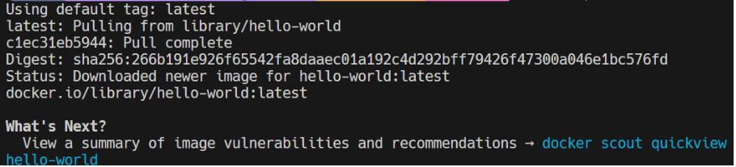
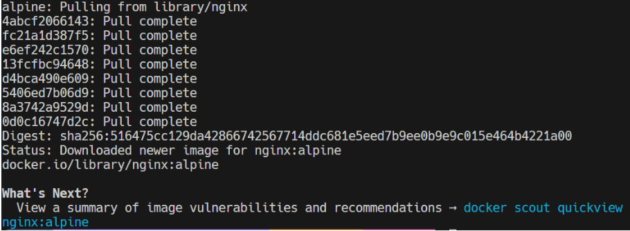
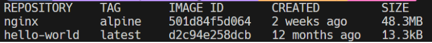
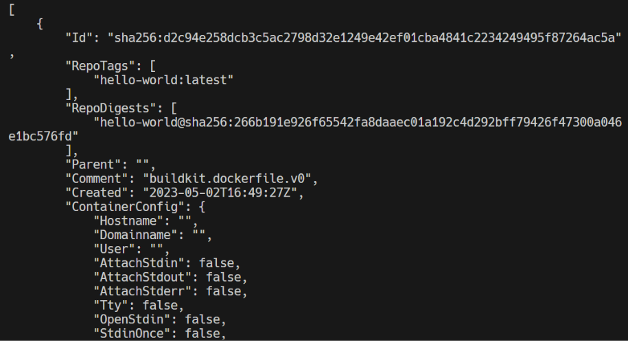
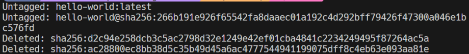

# Imagen
Es un archivo único que contiene todos los programas, librerías, dependencias y configuraciones necesarias para instalar y/o ejecutar una aplicación o un conjunto de aplicaciones.


## ¿Cuál es la relación entre una imagen y un contenedor? 
# COMPLETAR
En el contexto de Docker, una imagen es una plantilla inmutable que contiene todo lo necesario para ejecutar una aplicación, incluyendo el código, las dependencias y el sistema operativo. Un contenedor es una instancia en ejecución de una imagen, que utiliza la imagen como base para crear un entorno aislado donde se ejecuta la aplicación. La relación entre una imagen y un contenedor es que la imagen es el contenido visual o el archivo gráfico, mientras que el contenedor es la estructura que la encapsula para organizarla, presentarla o ejecutarla en un contexto específico.


## Comandos para imágenes

### Descargar imagen
Descarga la última versión de la imagen disponible en el registro de Docker.

```
docker pull <nombre imagen> 
```

Descarga una versión específica de la imagen, cada imagen tiene etiquetas (tags) para diferentes versiones.
Una imagen puede tener la etiqueta latest para representar la última versión, si no se especifica una etiqueta se hará referencia a la versión latest.

```
docker pull <nombre imagen>:<tag>
```

Descargar la imagen **hello-world**

```
docker pull hello-world
```



# COMPLETAR

**¿Qué es nginx**
# COMPLETAR
Nginx es un servidor web de código abierto ampliamente utilizado que destaca por su alta eficiencia y versatilidad. Nginx está diseñado para manejar un gran número de conexiones simultáneas de manera eficiente, utilizando menos recursos del sistema. Nginx es una herramienta poderosa y flexible que se utiliza ampliamente para mejorar el rendimiento, la escalabilidad y la seguridad de las aplicaciones web modernas. Su arquitectura ligera y su capacidad para manejar grandes volúmenes de tráfico lo convierten en una opción popular para una amplia gama de escenarios de implementación.

Descargar la imagen  **nginx** en la versión **alpine**

```
docker pull nginx:alpine
```


# COMPLETAR

### Listar imágenes

```
docker images
```



# COLOCAR UNA CAPTURA DE PANTALLA DEL RESULTADO 

**Identificadores**
En Docker, se utilizan varios identificadores para diferenciar de manera única los elementos del sistema, como imágenes, contenedores, volúmenes y redes. Estos identificadores son generados automáticamente por Docker y son únicos dentro del contexto del sistema Docker en el que se encuentran. 

### Inspeccionar una imagen
El comando docker inspect se utiliza para obtener información detallada sobre un objeto de Docker específico, como un contenedor, una imagen, un volumen o una red.  Proporciona información en formato JSON sobre el objeto especificado.

```
docker inspect <nombre imagen>
docker inspect <nombre imagen>:<tag>
```

Inspeccionar la imagen hello-world 

```
docker inspect hello-word
```



# COMPLETAR

**¿Con qué algoritmo se está generando el ID de la imagen**
# COMPLETAR

Para generar el ID de una imagen en el contexto de Docker, se utiliza el algoritmo de hash SHA-256. Cuando se crea una imagen de Docker, esta se compone de varias capas, y cada capa es un sistema de archivos representado por un tarball. Docker aplica el algoritmo de hash SHA-256 a cada una de estas capas y a los metadatos de la imagen para generar una cadena de 64 caracteres que representa el ID de la imagen.

Aquí un ejemplo del ID:

```
[
    {
        "Id": "sha256:d2c94e258dcb3c5ac2798d32e1249e42ef01cba4841c2234249495f87264ac5a",
        ...
    }
]
```

### Filtrar imágenes

```
docker images | grep <termino a buscar>

```

### Para eliminar una imagen
Eliminar permanentemente la imagen de tu sistema Docker.

```
docker rmi <nombre imagen>:<tag>
```

Eliminar la imagen hello-world 

```
docker rmi hello-world 
```



# COMPLETAR

-f: Es la opción para forzar la eliminación de la imagen incluso si hay contenedores en ejecución que utilizan esa imagen.
Cuando eliminas una imagen Docker, Docker no elimina automáticamente los contenedores que se han creado a partir de esa imagen. Esto significa que, aunque hayas eliminado la imagen, el contenedor seguirá ejecutándose normalmente.  
**Considerar**
Eliminar una imagen no afecta a los contenedores que se han creado a partir de esa imagen, a menos que esos contenedores dependan de archivos o configuraciones específicas de la imagen eliminada. En ese caso, es posible que los contenedores se comporten de manera inesperada después de eliminar la imagen.
Es una buena práctica detener y eliminar todos los contenedores que dependan de una imagen antes de eliminar la imagen en sí.

```
docker rmi -f <nombre imagen>:<tag>
```

# Comando

```
docker rmi -f hello-world
```

