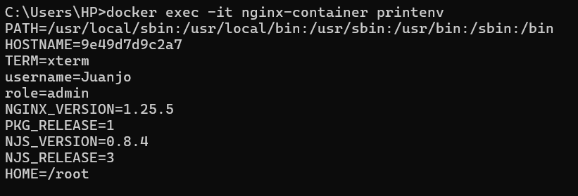
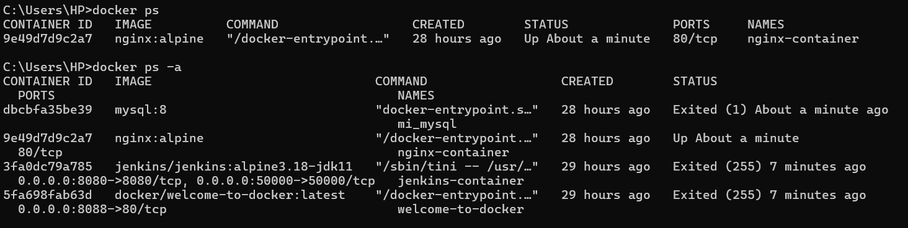
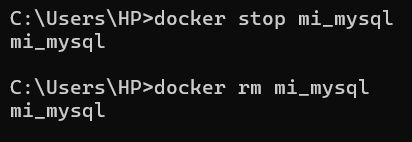
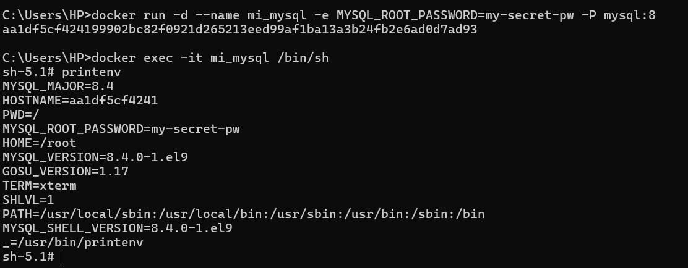
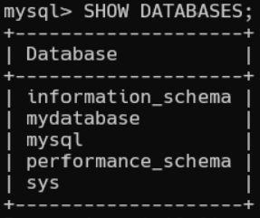

# Variables de Entorno
### ¿Qué son las variables de entorno?


Las variables de entorno son valores dinámicos que pueden afectar el comportamiento de los contenedores Docker y las aplicaciones que se ejecutan dentro de ellos. Estas variables proporcionan una forma de configurar y personalizar el entorno de ejecución de los contenedores, como las credenciales de conexión a bases de datos, las URL de servicios externos o las configuraciones específicas de la aplicación.

### Para crear un contenedor con variables de entorno

```
docker run -d --name <nombre contenedor> -e <nombre variable1>=<valor1> -e <nombre variable2>=<valor2>
```

### Crear un contenedor a partir de la imagen de nginx:alpine con las siguientes variables de entorno: username y role. Para la variable de entorno rol asignar el valor admin.

# COMANDO
### Creacion de la variable de entorno

```
docker run -d --name nginx-container -e username=Juanjo -e role=admin nginx:alpine
```

# COMANDO
# Visualización de la variable de entorno
```
docker exec -it nginx-container printenv
```

# CAPTURA CON LA COMPROBACIÓN DE LA CREACIÓN DE LAS VARIABLES DE ENTORNO DEL CONTENEDOR ANTERIOR



### Crear un contenedor con mysql:8 , mapear todos los puertos
# COMANDO

```
docker run -d --name mi_mysql -e MYSQL_ROOT_PASSWORD=my-secret-pw -P mysql:8
```

### ¿El contenedor se está ejecutando?

Como se puede observar el contenedor si se esta ejecutando y se lo puede evidenciar ejecutando el siguiente comando:

# COMANDO

```
docker ps
```



### Eliminar el contenedor creado con mysql:8 

Para detener el contenedor se aplica el siguiente comando:

```
docker ps
```

Para eliminar el contenedor se aplica el siguiente comando:

```
docker ps
```



### Para crear un contenedor con variables de entorno especificadas
- Portabilidad: Las aplicaciones se vuelven más portátiles y pueden ser desplegadas en diferentes entornos (desarrollo, pruebas, producción) simplemente cambiando el archivo de variables de entorno.
- Centralización: Todas las configuraciones importantes se centralizan en un solo lugar, lo que facilita la gestión y auditoría de las configuraciones.
- Consistencia: Asegura que todos los miembros del equipo de desarrollo o los entornos de despliegue utilicen las mismas configuraciones.
- Evitar Exposición en el Código: Mantener variables sensibles como contraseñas, claves API, y tokens fuera del código fuente reduce el riesgo de exposición accidental a través del control de versiones.
- Control de Acceso: Los archivos de variables de entorno pueden ser gestionados con permisos específicos, limitando quién puede ver o modificar la configuración sensible.

Previo a esto es necesario crear el archivo y colocar las variables en un archivo, **.env** se ha convertido en una convención estándar, pero también es posible usar cualquier extensión como **.txt**.
```
docker run -d --name <nombre contenedor> --env-file=<nombreArchivo>.<extensión> <nombre imagen>
```
**Considerar**
Es necesario especificar la ruta absoluta del archivo si este se encuentra en una ubicación diferente a la que estás ejecutando el comando docker run.

### Crear un contenedor con mysql:8 , mapear todos los puertos y configurar las variables de entorno mediante un archivo

# COMANDO

```
docker run -d --name mi_mysql -e MYSQL_ROOT_PASSWORD=my-secret-pw -P mysql:8
```

### Para agregarlo a un archivo:

```
MYSQL_ROOT_PASSWORD=my-secret-pw
MYSQL_DATABASE=mydatabase
MYSQL_USER=Juanjo
MYSQL_PASSWORD=mypassword
```

### Para ejecutar:

```
docker run -d --name mi_mysql --env-file=mysql-env.env -P mysql:8
```

# CAPTURA CON LA COMPROBACIÓN DE LA CREACIÓN DE LAS VARIABLES DE ENTORNO DEL CONTENEDOR ANTERIOR 



### ¿Qué bases de datos existen en el contenedor creado?
Las bases de datos que existen dentro del contenedor creado son las siguientes:




