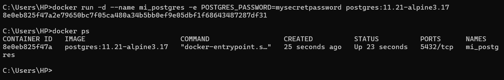
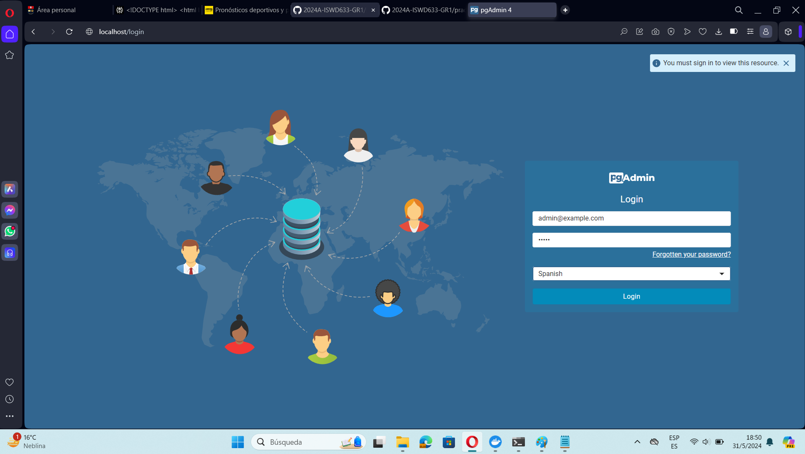
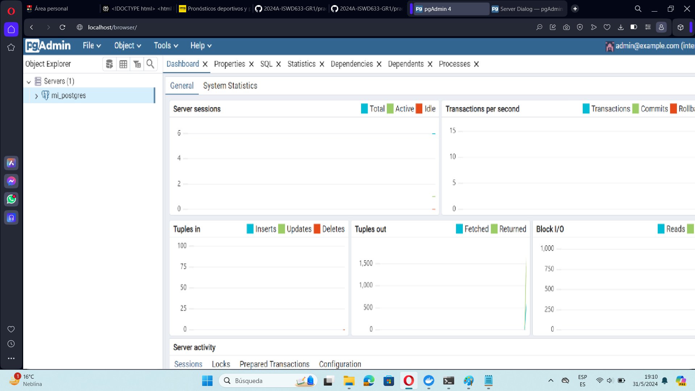
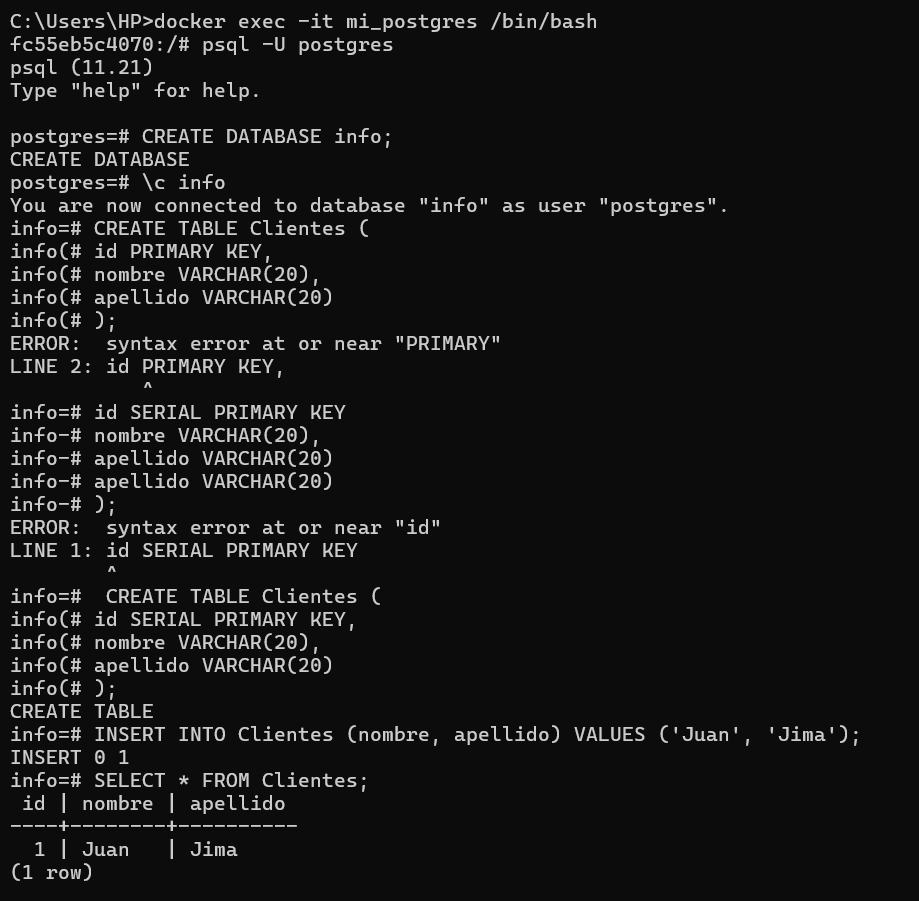
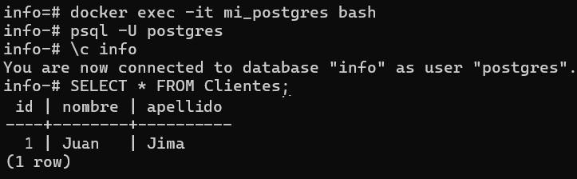

### Crear contenedor de Postgres sin que exponga los puertos. Usar la imagen: postgres:11.21-alpine3.17
# COMANDO

Creamos el contenedor en Postgre aplicando el siguiente comando:

```
docker run -d --name mi_postgres -e POSTGRES_PASSWORD=mysecretpassword postgres:11.21-alpine3.17
```

Para comprobar que el puerto se encuentra cargado correctamente se aplica el siguiente comando:

```
docker ps
```
# EVIDENCIA



### Crear un cliente de postgres. Usar la imagen: dpage/pgadmin4

# 1. Crear una red Docker personalizada:

```
docker network create nueva_red
```

# 2. Crear el contenedor de PostgreSQL en la red personalizada:

```
docker run -d --name mi_postgres --network nueva_red -e POSTGRES_PASSWORD=mysecretpassword postgres:11.21-alpine3.17
```

# 3. Crear el contenedor de pgAdmin en la red personalizada:

```
docker run -d --name pgadmin4 --network nueva_red -e PGADMIN_DEFAULT_EMAIL=admin@example.com -e PGADMIN_DEFAULT_PASSWORD=admin -p 80:80 dpage/pgadmin4
```

# 4. Configurar la Conexión a PostgreSQL desde pgAdmin:

```
http://localhost
```

# EVIDENCIA



La figura presenta el esquema creado en donde los puertos son:
- a: Puerto (5432) --> por defecto de PostgreSQL en el contenedor.
- b: Puerto (32769) --> mapeado en el host para PostgreSQL.
- c: Puerto (80) --> mapeado en el host para pgAdmin.


## Desde el cliente
### Acceder desde el cliente al servidor postgres creado.
# EVIDENCIA



### Crear la base de datos info, y dentro de esa base la tabla personas, con id (serial) y nombre (varchar), agregar un par de registros en la tabla, obligatorio incluir su nombre.

# 1. Accede al contenedor de PostgreSQL:

```
docker exec -it mi_postgres /bin/bash
```

# 2. Inicia sesión en PostgreSQL como usuario PostgreSQL:

```
psql -U postgres
```

# 3. Crear la Base de Datos PostgreSQL:

```
CREATE DATABASE info;
```

# 4. Conectar a la Base de Datos info:

```
\c info
```

# 5. Crear la Tabla personas para la Base de Datos PostgreSQL:

```
CREATE TABLE Clientes (
    id PRIMARY KEY,
    nombre VARCHAR(20),
    apellido VARCHAR(20)
);
```

# 6. Insertar Registros en la Tabla Clientes en la Base de Datos PostgreSQL:

```
INSERT INTO Clientes (nombre, apellido) VALUES ('Juan', 'Jima');
```

# EVIDENCIA



## Desde el servidor postgres
### Acceder al servidor
### Conectarse a la base de datos info

# 1. Accede al Contenedor de PostgreSQL:

```
docker exec -it mi_postgres /bin/bash
```

# 2. Inicia sesión en PostgreSQL como usuario PostgreSQL:

```
psql -U postgres
```

# 3. Conectar a la Base de Datos info:

```
\c info
```

# 4. Para buscar el dato ingresado en la Base de Datos de PostgreSQL:

```
 SELECT * FROM Clientes;
```

# EVIDENCIA


