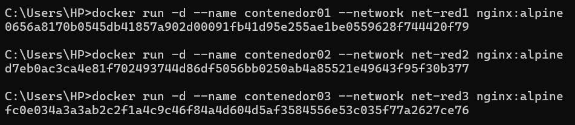
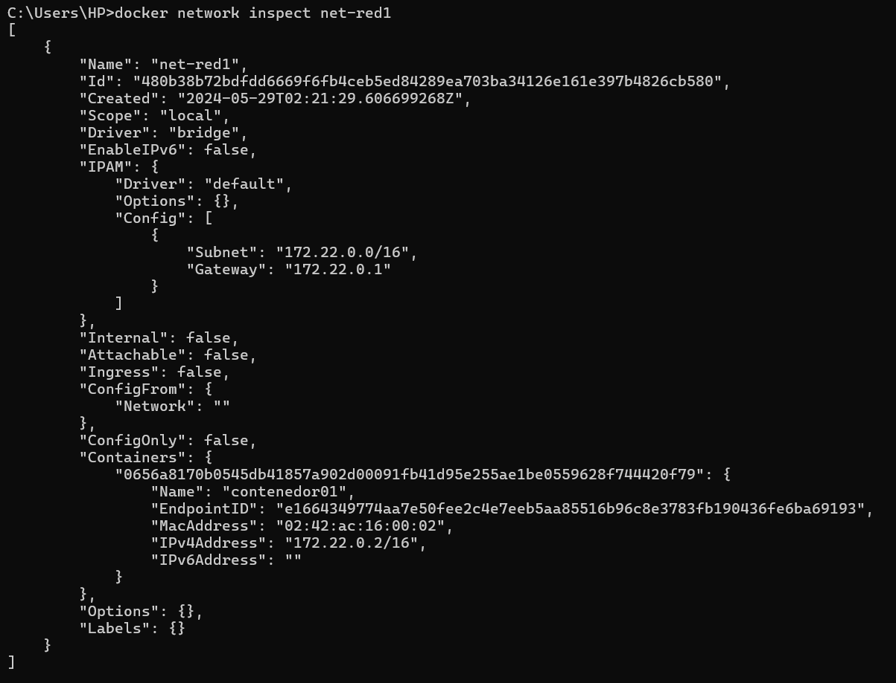
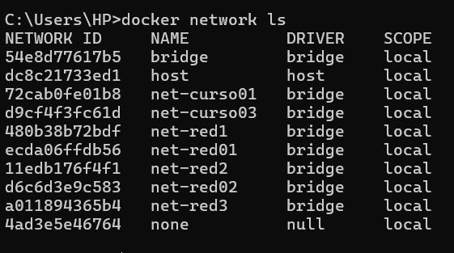
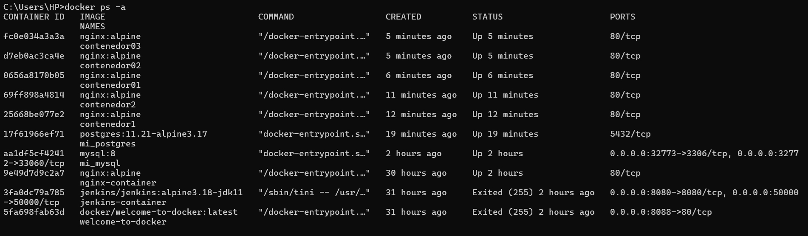
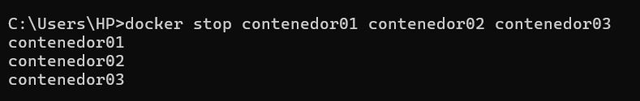
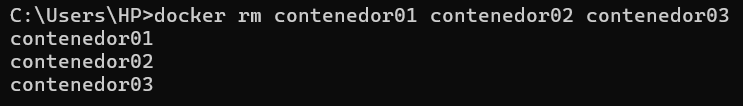
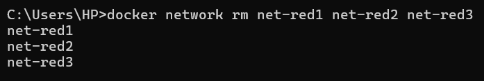

# Redes
Las redes son un componente fundamental que permite la comunicación entre contenedores, así como la comunicación de los contenedores con el mundo exterior. 

- Bridge: Esta es la red por defecto en Docker. Permite la comunicación entre contenedores en el mismo host. Cada contenedor conectado a la red bridge tiene una IP propia en la subred de la red bridge.
    -  Brige por default: Cuando se ejecuta un contenedor, Docker crea automáticamente una red de tipo bridge por default. Esta red se utiliza para permitir la comunicación entre contenedores en el mismo host. Cada contenedor conectado a esta red obtiene su propia dirección IP en la subred de la red bridge.
    - Bridge creada por nosotros: Un usuario también puede crear sus propias redes de tipo bridge en Docker. Esto puede ser útil para organizar y segmentar los contenedores de una aplicación de manera más controlada. Al crear una red bridge personalizada, se puede especificar un rango de direcciones IP y otras configuraciones de red específicas. Los contenedores conectados a esta red utilizarán las direcciones IP de la subred definida por el usuario.
- Host: Con esta red, los contenedores comparten la red del host en lugar de tener su propia interfaz de red. Esto puede mejorar el rendimiento de red, pero los contenedores pueden entrar en conflicto con los puertos del host si intentan utilizar los mismos puertos.
- None: Con esta red, se deshabilita la configuración de red. Los contenedores que usan esta red tienen su propia red de bucle invertido y no pueden comunicarse con otros contenedores a menos que se conecten explícitamente a una red.

### Crear una red de tipo bridge

```
docker network create <nombre red> -d bridge
```

### Crear un contenedor vinculado a una red

```
docker run -d --name <nombre contenedor> --network <nombre red> <nombre imagen>
```

### Para saber a qué red está conectado un contenedor

```
docker inspect <nombre contenedor>
```
ó
```
docker network inspect <nombre red> 
```

### Vincular contenedor a una red
```
docker network connect <nombre red> <nombre contenedor>
```

### Para desvincular un contenedor de una red
```
docker network disconnect <nombre red> <nombre contenedor>
```

### Para listar las redes existentes
```
docker network ls
```

### Crear los contenedores y las redes que se presentan en el esquema. Usar para todos los contenedores la imagen de nginx:alpine


# Realización del Punto 4 siguiendo los pasos anteriores evidenciando el trabajo realizado a travéz de capturas de pantalla.
### Creación de las redes net-red1 net-red2 net-red3

```
docker network create net-red1 -d bridge
docker network create net-red2 -d bridge
docker network create net-red3 -d bridge
```

# Creación de las contenedores vinculados a las redes
### Creación del contenedor01 en net-red1

```
docker run -d --name contenedor01 --network net-red1 nginx:alpine
```

### Creación del contenedor02 en net-red2

```
docker run -d --name contenedor02 --network net-red2 nginx:alpine
```

### Creación del contenedor03 en net-red3

```
docker run -d --name contenedor03 --network net-red3 nginx:alpine
```




### Verificar la conexión de los contenedores a las Redes creadas

```
docker network inspect net-red1
docker network inspect net-red2
docker network inspect net-red3
```




### Listar todas las Redes creadas

```
docker network ls
```




### Listar todos los contenedores y sus redes

```
docker ps -a
```




### Detener los contenedores que están utilizando las redes

```
docker stop contenedor01 contenedor02 contenedor03
```




### Eliminar los contenedores que están utilizando las redes

```
docker rm contenedor01 contenedor02 contenedor03
```




### Eliminar las redes creadas anteriormente

```
docker network rm net-red1 net-red2 net-red3
```


