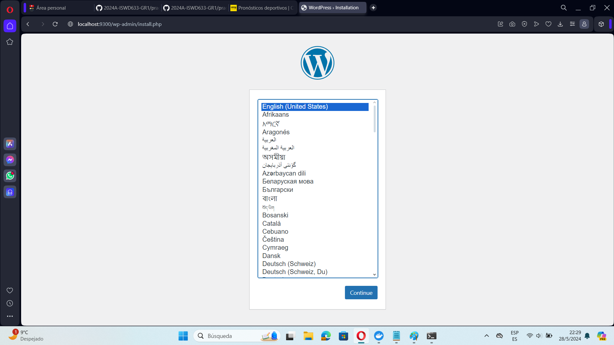
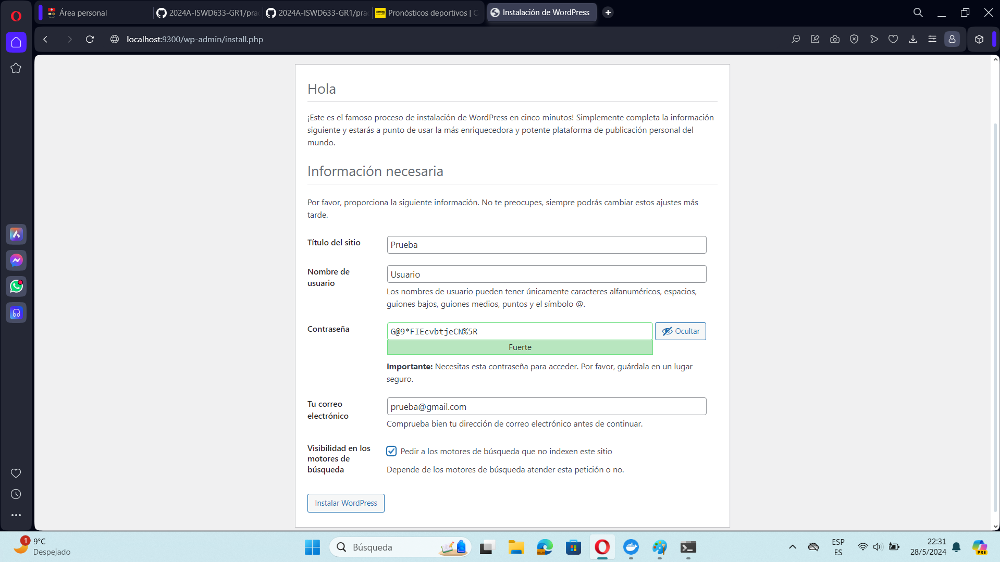
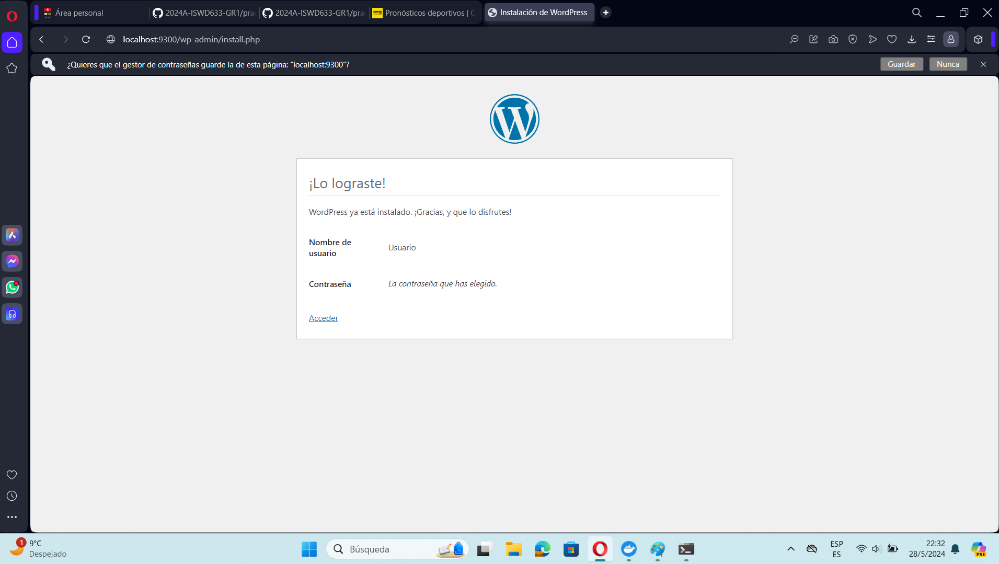
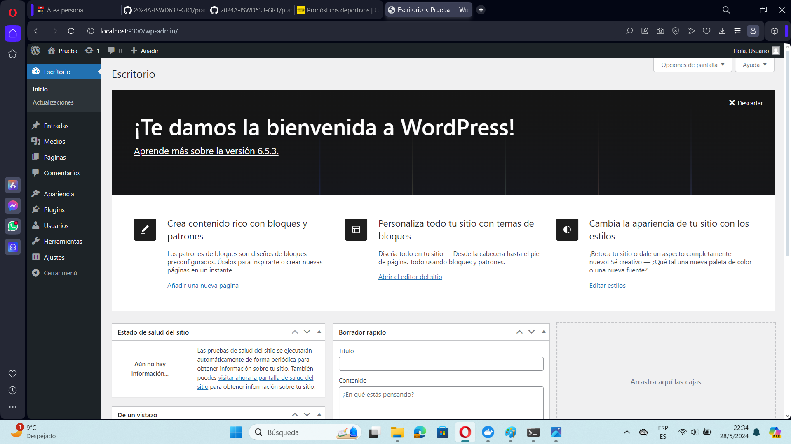
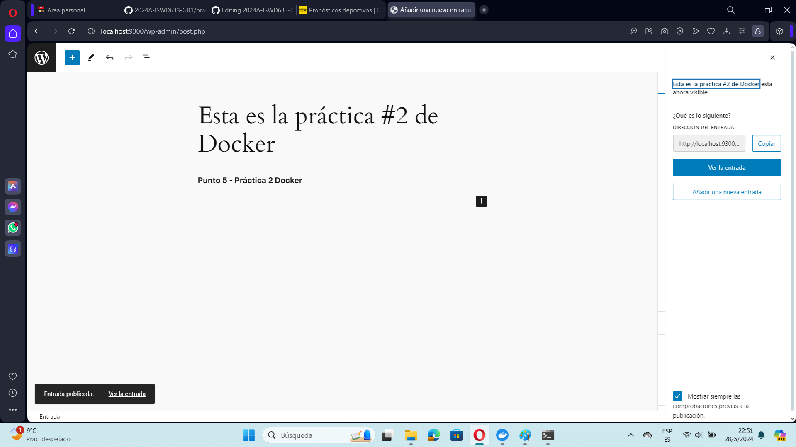
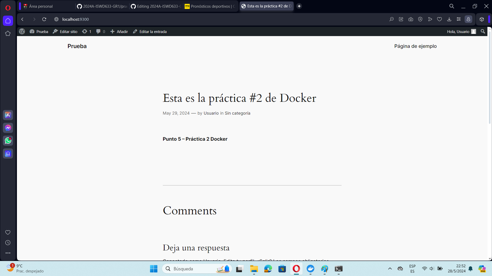
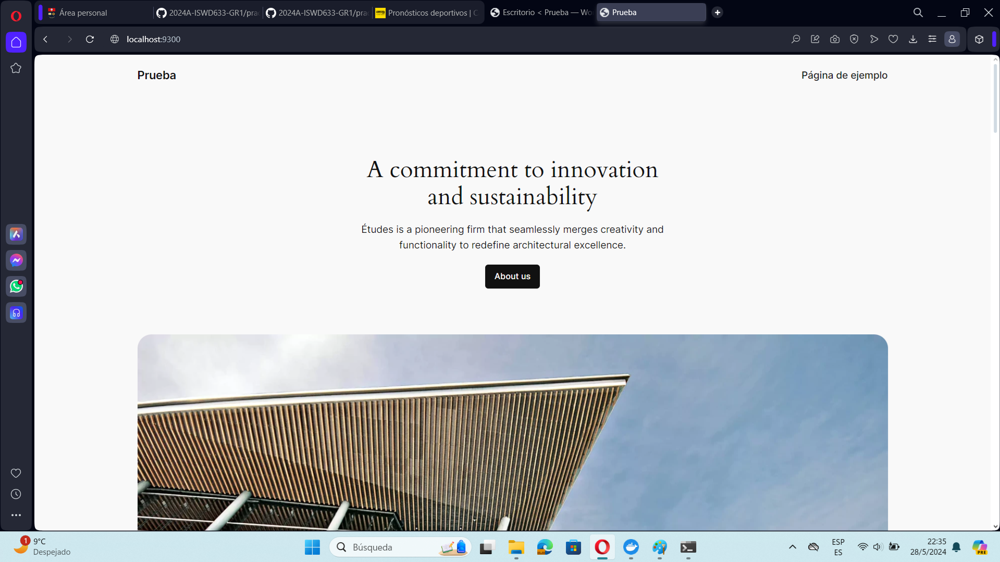

## Esquema para el ejercicio


### Crear la red
Para crear la red net-wp se ejecuta el siguiente comando:

```
docker network create net-wp
```

### Crear el contenedor mysql a partir de la imagen mysql:8, configurar las variables de entorno necesarias

```
docker run -d --name mysql --network net-wp -e MYSQL_ROOT_PASSWORD=my-secret-pw -e MYSQL_DATABASE=wordpress -e MYSQL_USER=wpuser -e MYSQL_PASSWORD=wppassword mysql:8
```

### Crear el contenedor wordpress a partir de la imagen: wordpress, configurar las variables de entorno necesarias

```
docker run -d --name wordpress --network net-wp -e WORDPRESS_DB_HOST=mysql:3306 -e WORDPRESS_DB_NAME=wordpress -e WORDPRESS_DB_USER=wpuser -e WORDPRESS_DB_PASSWORD=wppassword -p 9300:80 wordpress
```

### Para poder acceder a WordPress se debe completar la configuración de instalación de WordPress.

```
http://localhost:9300/
```
### Ingresar desde el navegador al wordpress y finalizar la configuración de instalación.













# COLOCAR UNA CAPTURA DEL SITO EN DONDE SEA VISIBLE LA PUBLICACIÓN.







Luego de ejeuctar los comandos respectivos y ejecutar wordpress se puede decir que en el esquema de ejercicio el puerto es el (9300).

### Eliminar el contenedor wordpress

Se debe ejecutar el siguiente comando para poder eliminar el contenedor de Wordpress

```
docker rm -f wordpress
```

### Crear nuevamente el contenedor wordpress
Ingresar a: http://localhost:9300/ 
recordar que a es el puerto que usó para el mapeo con wordpress

```
docker run -d --name wordpress --network net-wp -e WORDPRESS_DB_HOST=mysql:3306 -e WORDPRESS_DB_NAME=wordpress -e WORDPRESS_DB_USER=wpuser -e WORDPRESS_DB_PASSWORD=wppassword -p 9300:80 wordpress
```


### ¿Qué ha sucedido, qué puede observar?

Despues de realizar los pasos respectivos se puede observar que la pantalla del wordpress se quedó con una publicación predeterminada de la misma aplicación.




